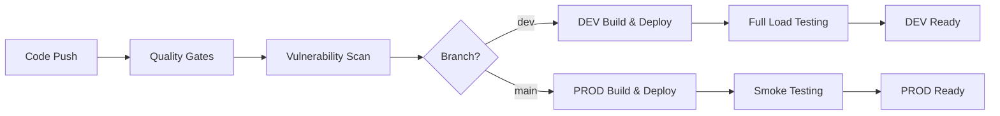

# Lead Scoring API

A fast API service that scores business leads to help marketing teams identify which leads are most likely to become customers. Uses machine learning and includes automated testing and deployment.

## Features

### **What It Does**
- **Fast Processing**: Can handle 300 requests per second, responds in less than 1 second
- **Smart Scoring**: Uses machine learning to analyze 50 different pieces of information about each lead
- **Batch Processing**: Can score 1 to 500 leads at once

### **Production Infrastructure**
- **Container Ready**: Docker containerization with multi-stage builds and health checks
- **ECS Fargate Optimized**: Full AWS ECS deployment with auto-scaling and load balancing
- **Data Lake Integration**: Automatic S3/Athena data lake writes with flattened feature storage
- **CloudWatch Metrics**: Comprehensive performance and business metrics publishing

### **Enterprise Security & Quality**
- **Zero-Tolerance Security**: Automated security scanning with bandit and Trivy
- **Comprehensive Testing**: 75%+ code coverage requirement with multiple test layers
- **Environment-Aware Load Testing**: Full performance validation in DEV, smoke testing in PROD
- **Production-Safe Validation**: Smoke tests with easily identifiable test data patterns

## Quick Start

### Local Development

```bash
# Install dependencies
uv sync

# Run the application
uv run uvicorn app.main:app --reload --host 0.0.0.0 --port 8000

# Health check
curl http://localhost:8000/api/v1/health
```

### Docker Deployment

```bash
# Build image
docker build -t lead-scoring-api .

# Run container
docker run -p 8000:8000 lead-scoring-api

# Health check
curl http://localhost:8000/api/v1/health
```

### ECS Fargate Deployment

The application is optimized for AWS ECS Fargate deployment:

- **Container Port**: 8000
- **Health Check**: `/api/v1/health`
- **Resource Requirements**: 512 CPU, 1024 Memory (minimum)
- **Load Balancer**: Application Load Balancer with health checks
- **Logging**: CloudWatch log driver for structured logs
- **Environment Variables**: Configure via ECS task definition

## API Usage

### Score Leads Endpoint

```bash
POST /api/v1/scoring/score
```

**Complete API Request Example with All 50+ Features:**

```json
{
  "request_id": "batch-scoring-001",
  "leads": [
    {
      "company_size": "Enterprise",
      "industry": "Technology",
      "job_title": "VP Marketing",
      "seniority_level": "Executive", 
      "geography": "North America",
      "email_engagement_score": 0.85,
      "website_sessions": 15,
      "pages_viewed": 45,
      "time_on_site": 32.5,
      "form_fills": 3,
      "content_downloads": 7,
      "campaign_touchpoints": 12,
      "last_campaign_interaction": "2024-08-20T10:30:00Z",
      "account_revenue": 5000000.0,
      "account_employees": 500,
      "existing_customer": false,
      "custom_features": {
        "custom_feature_1": 0.75,
        "custom_feature_2": 1.2,
        "custom_feature_3": 0.95,
        "custom_feature_4": 2.1,
        "custom_feature_5": 0.65,
        "custom_feature_6": 1.8,
        "custom_feature_7": 0.45,
        "custom_feature_8": 3.2,
        "custom_feature_9": 0.88,
        "custom_feature_10": 1.45,
        "custom_feature_11": 0.33,
        "custom_feature_12": 2.7,
        "custom_feature_13": 0.92,
        "custom_feature_14": 1.1,
        "custom_feature_15": 0.58,
        "custom_feature_16": 2.3,
        "custom_feature_17": 0.77,
        "custom_feature_18": 1.6,
        "custom_feature_19": 0.41,
        "custom_feature_20": 2.9,
        "custom_feature_21": 0.69,
        "custom_feature_22": 1.35,
        "custom_feature_23": 0.82,
        "custom_feature_24": 2.15,
        "custom_feature_25": 0.54,
        "custom_feature_26": 1.9,
        "custom_feature_27": 0.73,
        "custom_feature_28": 2.4,
        "custom_feature_29": 0.61,
        "custom_feature_30": 1.25,
        "custom_feature_31": 0.89,
        "custom_feature_32": 2.6,
        "custom_feature_33": 0.47,
        "custom_feature_34": 1.7
      }
    }
  ]
}
```

**Response Example:**

```json
{
  "request_id": "batch-scoring-001",
  "timestamp": "2024-08-24T10:30:00Z",
  "total_leads": 1,
  "processing_time_ms": 45.2,
  "scores": [
    {
      "score": 4,
      "confidence": 0.87,
      "features_used": 50,
      "prediction_time_ms": 45.2
    }
  ],
  "model_version": "1.0.0",
  "status": "success"
}
```

### Feature Categories

**Core Features (16):**
- Contact/Lead: `company_size`, `industry`, `job_title`, `seniority_level`, `geography`
- Behavioral: `email_engagement_score`, `website_sessions`, `pages_viewed`, `time_on_site`, `form_fills`, `content_downloads`
- Campaign: `campaign_touchpoints`, `last_campaign_interaction`
- Account: `account_revenue`, `account_employees`, `existing_customer`

**Custom Features (34):**
- Extensible: `custom_feature_1` through `custom_feature_34` for domain-specific signals

### Batch Processing

```bash
# Test with sample curl (20 leads with all 50+ features)
curl -X POST "http://localhost:8000/api/v1/score" \
  -H "Content-Type: application/json" \
  -d '{
    "request_id": "test-batch-001",
    "leads": [...] // See complete example above
  }'
```

## Monitoring & Observability

### Health Checks
- **Health**: `GET /api/v1/health`

### Logging
- **Structured Logging**: JSON-formatted logs with request IDs and metadata
- **CloudWatch Integration**: Ready for AWS CloudWatch log aggregation

## Data Lake Integration

### **Automatic Data Storage**
All prediction requests are automatically stored in AWS S3/Athena data lake for analytics:

**Storage Pattern:**
- **Raw Features**: Original input data with `raw_` prefix
- **Engineered Features**: Model-processed features with `engineered_` prefix  
- **Flattened Custom Features**: `custom_feature_*` stored as individual columns
- **Prediction Results**: Scores, confidence, processing metadata
- **Partitioning**: By year/month/day for efficient querying

**Data Lake Schema:**
```sql
-- Athena table structure
CREATE TABLE lead_score_prod (
    request_id string,
    lead_id string,
    model_version string,
    timestamp timestamp,
    score int,
    confidence double,
    features_used int,
    processing_time_ms double,
    -- Raw input features
    raw_company_size string,
    raw_industry string,
    raw_email_engagement_score double,
    raw_custom_feature_1 double,
    raw_custom_feature_2 double,
    -- ... (all 50+ features)
    -- Engineered features
    engineered_company_size_encoded int,
    engineered_email_engagement_score double,
    -- ... (all model features)
) PARTITIONED BY (
    year int,
    month int, 
    day int
)
```

## Load Testing & Performance Validation

### **Environment-Aware Testing Strategy**

**Development Environment:**
```bash
# Full performance testing suite
ENV=dev python tests/test_load.py
ENV=dev pytest tests/test_load.py -v

# Tests included:
- Single request performance (<1s)
- Batch processing (5-50 leads)  
- Concurrent load testing (20 requests, 5 concurrent)
- Stress testing (50 requests, 10 concurrent)
- Maximum batch size validation (500 leads)
```

**Production Environment:**
```bash  
# Conservative smoke testing only
ENV=prod python tests/test_load.py
ENV=prod pytest tests/test_load.py::test_single_request_load -v

# Smoke tests included:
- Single request validation
- Basic batch processing
- Health endpoint verification
- Performance baseline (<10s threshold)
```


### **Smoke Test Data Safety**

**Test Data Identification:**
All smoke tests use clearly identifiable request IDs for easy filtering:

```python
# Production smoke test patterns
"prod-verification"      # Health check test
"prod-baseline-test"     # Performance baseline
"load-test-{num}-{timestamp}"  # Load test pattern
```

**Data Lake Filtering:**
```sql
-- Exclude all test data from business analytics
SELECT * FROM lead_score_prod 
WHERE request_id NOT LIKE 'prod-%' 
  AND request_id NOT LIKE 'load-test-%';

-- Find all smoke test data for auditing
SELECT * FROM lead_score_prod 
WHERE request_id IN ('prod-verification', 'prod-baseline-test');
```

**Data Safety Guarantees:**
- **No CRM Data Corruption**: Tests only write to analytics data lake
- **Easily Identifiable**: Clear request ID patterns for filtering
- **Minimal Footprint**: 1-2 test records per smoke test run
- **No Business Logic Impact**: Read-only operations on production data

## Comprehensive CI/CD Pipeline

### **Quality Gates (All Environments)**

**1. Code Quality & Security:**
```yaml
- Linting: black, ruff formatting validation
- Type Checking: mypy static analysis  
- Security Scanning: bandit (0 issues tolerated)
- Vulnerability Scanning: Trivy filesystem scan
- Unit Testing: pytest with 75%+ coverage requirement
```

**2. Container Security:**
```yaml
- Secure Docker builds with minimal container images (no extra operating system components)
- Container vulnerability scanning with ECR
- Image signing and provenance tracking
- Zero critical vulnerabilities policy
- Maximum 3 high-severity vulnerabilities
```

### **Environment-Specific Workflows**

#### **Development Branch (`dev` → DEV Environment)**

**Deployment Pipeline:**
1. **Quality Gates** → **Security Scans** → **Build & Push**
2. **ECS Deployment** → **Service Stabilization** 
3. **Full Load Testing** → **Health Verification**

**Load Testing (Comprehensive):**
- Single request performance validation
- Batch processing tests (5-50 leads)
- Concurrent load testing (20 requests, 5 concurrent) 
- Stress testing (50 requests, 10 concurrent)
- Data variety testing with realistic correlation patterns

**Target URLs:**
- DEV Environment: `http://alb-lead-scoring-dev-263460192.eu-west-1.elb.amazonaws.com`

#### **Production Branch (`main` → PROD Environment)**

**Deployment Pipeline:**
1. **Quality Gates** → **Security Scans** → **Build & Push**
2. **Git Tagging** → **Container Scanning** → **ECS Deployment**
3. **Smoke Testing** → **Health Verification** → **Performance Baseline**

**Smoke Testing (Conservative):**
- Single request validation
- Basic batch processing test
- Health endpoint verification  
- End-to-end prediction test
- Performance baseline validation (<10s)

**Target URLs:**
- PROD Environment: `http://alb-lead-scoring-1394767465.eu-west-1.elb.amazonaws.com`

### **Pipeline Orchestration**



### **Key Pipeline Features**

**Automated Quality Assurance:**
- **Zero-tolerance security policy** with automated blocking
- **Comprehensive test coverage** with 75% minimum requirement  
- **Performance regression detection** via load testing
- **Production safety validation** via smoke testing

**Environment Isolation:**
- **Separate ECR repositories** for DEV/PROD images
- **Environment-specific testing strategies** (aggressive vs conservative)
- **Isolated AWS resources** with proper IAM boundaries
- **Branch-based deployment triggers** for controlled releases

**Operational Excellence:**
- **Automated service health verification** post-deployment
- **Performance baseline monitoring** to detect regressions
- **Structured deployment notifications** with success metrics
- **Comprehensive logging and tracing** throughout pipeline

## Architecture Overview

### **System Architecture**
```
┌─────────────────┐    ┌──────────────────┐    ┌─────────────────┐
│   Application   │    │   Load Balancer  │    │   ECS Fargate   │
│   Load Balancer │ -> │    (ALB)         │ -> │   Containers    │
│                 │    │                  │    │                 │
└─────────────────┘    └──────────────────┘    └─────────────────┘
                                                        │
                       ┌─────────────────┐             │
                       │   CloudWatch    │ <-----------┘
                       │    Metrics      │
                       │                 │
                       └─────────────────┘
                                │
                       ┌─────────────────┐
                       │   S3/Athena     │
                       │   Data Lake     │
                       │                 │
                       └─────────────────┘
```

### **Data Flow**
1. **Request** → ALB → ECS Fargate Container
2. **Processing** → XGBoost Model → Feature Engineering  
3. **Response** → JSON with scores and metadata
4. **Background Tasks** → Data Lake (S3/Athena) + CloudWatch Metrics
5. **Monitoring** → Health checks + Performance metrics

### **Key Components**
- **FastAPI Application**: High-performance async API with 50+ feature support
- **XGBoost Model**: Production ML model with feature engineering pipeline
- **Data Lake Integration**: Automatic S3/Athena storage with flattened features
- **CloudWatch Metrics**: Performance and business metrics publishing
- **Load Testing Framework**: Environment-aware testing with realistic data generation
- **CI/CD Pipeline**: Comprehensive quality gates with zero-tolerance security

## Environment Variables & Configuration

The application uses environment variables to configure behavior across different deployment environments and operational contexts.

### **Core Environment Variable: `ENV`**

**Variable:** `ENV`  
**Default:** `"prod"`  
**Values:** `"prod"` | `"dev"` | `"debug"` | `"test"`

**Usage:**
```python
# In app/core/config.py
env: str = "prod"
```

**Impact:**
- **Swagger UI**: Enabled only for `dev` and `debug` environments
- **Logging Level**: `DEBUG` for `debug`, `INFO` for others
- **Model Loading**: Skipped in `test` environment
- **Data Lake**: Routes to environment-specific S3 paths and Athena tables
- **CloudWatch Metrics**: Uses environment-specific namespaces

### **Environment-Specific Behaviors**

#### **`ENV=prod` (Production)**
```bash
export ENV=prod
```
**Configuration:**
- S3 Data Lake Path: `s3://ml-marketing-lead-scoring/inference_data/prod/`
- Athena Table: `lead_score_prod`
- CloudWatch Namespace: `LeadScoring/Prod`
- Log Stream: `lead-scoring-prod`
- Swagger UI: **Disabled**
- Debug Logging: **Disabled**

#### **`ENV=dev` (Development)**
```bash
export ENV=dev
```
**Configuration:**
- S3 Data Lake Path: `s3://ml-marketing-lead-scoring/inference_data/dev/`
- Athena Table: `lead_score_dev`
- CloudWatch Namespace: `LeadScoring/Dev`
- Log Stream: `lead-scoring-dev`
- Swagger UI: **Enabled**
- Debug Logging: **Disabled**

#### **`ENV=debug` (Debug)**
```bash
export ENV=debug
```
**Configuration:**
- Same as `dev` but with additional features:
- Debug Logging: **Enabled**
- File Logging: **Enabled**
- Swagger UI: **Enabled**
- Verbose Console Output: **Enabled**

#### **`ENV=test` (Testing)**
```bash
export ENV=test
```
**Configuration:**
- Model Loading: **Skipped** (uses mock model)
- AWS Services: **Mocked**
- S3/CloudWatch: **Disabled**
- In-Memory Operations: **Enabled**

### **Load Testing Environment Variable: `LOAD_TEST_ENV`**

**Variable:** `LOAD_TEST_ENV`  
**Default:** Uses `ENV` value, falls back to `"local"`  
**Values:** `"prod"` | `"dev"` | `"local"`

**Usage:**
```python
# In tests/test_load.py
external_env = os.environ.get("LOAD_TEST_ENV") or os.environ.get("ENV")
```

**URL Mapping:**
- **`LOAD_TEST_ENV=prod`**: `http://alb-lead-scoring-1394767465.eu-west-1.elb.amazonaws.com`
- **`LOAD_TEST_ENV=dev`**: `http://alb-lead-scoring-dev-263460192.eu-west-1.elb.amazonaws.com`
- **`LOAD_TEST_ENV=local`**: `http://localhost:8000`

**CI/CD Usage:**
```yaml
# DEV Environment Load Testing
env:
  LOAD_TEST_ENV: dev
  
# PROD Environment Smoke Testing  
env:
  LOAD_TEST_ENV: prod
```

### **AWS Configuration Variables**

#### **`AWS_DEFAULT_REGION`**
**Variable:** `AWS_DEFAULT_REGION`  
**Default:** `"eu-west-1"`  
**Usage:** Set automatically in test environment, configured in AWS credentials for production

#### **CI/CD Pipeline Variables**
```yaml
env:
  AWS_REGION: eu-west-1
  ECR_REPOSITORY_DEV: lead-scoring-api-dev
  ECR_REPOSITORY_PROD: lead-scoring-api-prod
  MIN_COVERAGE: 75
  MAX_SECURITY_ISSUES: 0
```

### **Model Configuration Constants**
These are constants rather than environment variables but are environment-aware:

```python
# S3 Model Storage
MODEL_S3_BUCKET = "ml-marketing-lead-scoring"
MODEL_S3_KEY = "model/model_v1_0_0.joblib"

# Environment-specific AWS Regions
AWS_REGION_DEV = "eu-west-1"
AWS_REGION_PROD = "eu-west-1"

# Environment-specific Data Lake Paths
DATA_LAKE_S3_PATH_DEV = "s3://ml-marketing-lead-scoring/inference_data/dev/"
DATA_LAKE_S3_PATH_PROD = "s3://ml-marketing-lead-scoring/inference_data/prod/"

# Environment-specific Athena Tables
DATA_LAKE_TABLE_NAME_DEV = "lead_score_dev"
DATA_LAKE_TABLE_NAME_PROD = "lead_score_prod"
```

### **Environment Variable Examples**

#### **Local Development:**
```bash
export ENV=dev
uvicorn app.main:app --reload --host 0.0.0.0 --port 8000
# Result: Swagger UI enabled, dev data lake, debug logging
```

#### **Local Load Testing:**
```bash
export LOAD_TEST_ENV=dev
python tests/test_load.py
# Result: Tests against DEV environment ALB
```

#### **Production Deployment:**
```bash
export ENV=prod
# Result: Production config, no Swagger UI, prod data lake
```

#### **CI/CD Testing:**
```bash
export ENV=test
pytest tests/
# Result: Mock model, no AWS calls, in-memory operations
```

### **Environment Variable Precedence**

1. **Load Testing**: `LOAD_TEST_ENV` takes precedence over `ENV` for URL routing
2. **Application Config**: `ENV` determines all application behavior
3. **Test Override**: Test framework sets `ENV=test` automatically
4. **Defaults**: Each variable has sensible defaults for development

### **Troubleshooting Environment Issues**

**Problem:** Load tests connecting to localhost instead of environment URL  
**Solution:** Ensure `LOAD_TEST_ENV` is set correctly

**Problem:** Swagger UI not appearing in development  
**Solution:** Verify `ENV=dev` or `ENV=debug`

**Problem:** Model not loading in tests  
**Solution:** Confirm `ENV=test` is set (should be automatic)

**Problem:** Data writing to wrong environment  
**Solution:** Check `ENV` value matches intended environment

## Getting Started for Development

### **Prerequisites**
```bash
# Install uv (fast Python package manager)
curl -LsSf https://astral.sh/uv/install.sh | sh

# Clone repository
git clone <repository-url>
cd lead_scoring_model
```

### **Development Workflow**
```bash  
# 1. Install dependencies
uv sync --dev

# 2. Run tests
uv run pytest tests/test_scoring.py -v
uv run pytest tests/test_load.py::test_single_request_load -v

# 3. Run linting and type checking  
uv run black app/ tests/ --check
uv run ruff check app/ tests/
uv run mypy app/

# 4. Start development server
uv run uvicorn app.main:app --reload --host 0.0.0.0 --port 8000

# 5. Test API
curl http://localhost:8000/api/v1/health
```

### **Production Deployment**
1. **Push to DEV**: Commit to `dev` branch triggers DEV deployment with full load testing
2. **Test in DEV**: Validate functionality using DEV environment URL
3. **Promote to PROD**: Create PR to `main` branch for production deployment with smoke testing
4. **Monitor**: Use CloudWatch metrics and Athena analytics for ongoing monitoring

---
