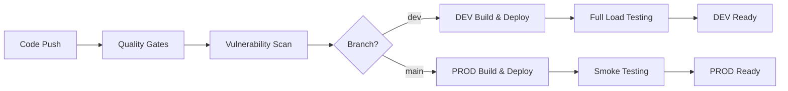

# Lead Scoring API

A production-ready FastAPI service for scoring B2B leads using XGBoost, designed for enterprise marketing team requirements with comprehensive CI/CD pipeline, load testing, and data lake integration.

## Features

### **Core Capabilities**
- **High Performance**: Handles ~300 requests/second with sub-1-second response times
- **Scalable Architecture**: Built with FastAPI and async processing with 50+ feature support
- **ML-Optimized**: XGBoost model with comprehensive feature engineering (16 core + 34 custom features)
- **Batch Processing**: Support for 1-500 leads per request with intelligent batching

### **Production Infrastructure**
- **Container Ready**: Docker containerization with multi-stage builds and health checks
- **ECS Fargate Optimized**: Full AWS ECS deployment with auto-scaling and load balancing
- **Data Lake Integration**: Automatic S3/Athena data lake writes with flattened feature storage
- **CloudWatch Metrics**: Comprehensive performance and business metrics publishing

### **Enterprise Security & Quality**
- **Zero-Tolerance Security**: Automated security scanning with bandit and Trivy
- **Comprehensive Testing**: 75%+ code coverage requirement with multiple test layers
- **Environment-Aware Load Testing**: Full performance validation in DEV, smoke testing in PROD
- **Production-Safe Validation**: Smoke tests with easily identifiable test data patterns

## Quick Start

### Local Development

```bash
# Install dependencies
uv sync

# Run the application
uv run uvicorn app.main:app --reload --host 0.0.0.0 --port 8000

# Health check
curl http://localhost:8000/api/v1/health
```

### Docker Deployment

```bash
# Build image
docker build -t lead-scoring-api .

# Run container
docker run -p 8000:8000 lead-scoring-api

# Health check
curl http://localhost:8000/api/v1/health
```

### ECS Fargate Deployment

The application is optimized for AWS ECS Fargate deployment:

- **Container Port**: 8000
- **Health Check**: `/api/v1/health`
- **Resource Requirements**: 512 CPU, 1024 Memory (minimum)
- **Load Balancer**: Application Load Balancer with health checks
- **Logging**: CloudWatch log driver for structured logs
- **Environment Variables**: Configure via ECS task definition

## API Usage

### Score Leads Endpoint

```bash
POST /api/v1/scoring/score
```

**Complete API Request Example with All 50+ Features:**

```json
{
  "request_id": "batch-scoring-001",
  "leads": [
    {
      "company_size": "Enterprise",
      "industry": "Technology",
      "job_title": "VP Marketing",
      "seniority_level": "Executive", 
      "geography": "North America",
      "email_engagement_score": 0.85,
      "website_sessions": 15,
      "pages_viewed": 45,
      "time_on_site": 32.5,
      "form_fills": 3,
      "content_downloads": 7,
      "campaign_touchpoints": 12,
      "last_campaign_interaction": "2024-08-20T10:30:00Z",
      "account_revenue": 5000000.0,
      "account_employees": 500,
      "existing_customer": false,
      "custom_features": {
        "custom_feature_1": 0.75,
        "custom_feature_2": 1.2,
        "custom_feature_3": 0.95,
        "custom_feature_4": 2.1,
        "custom_feature_5": 0.65,
        "custom_feature_6": 1.8,
        "custom_feature_7": 0.45,
        "custom_feature_8": 3.2,
        "custom_feature_9": 0.88,
        "custom_feature_10": 1.45,
        "custom_feature_11": 0.33,
        "custom_feature_12": 2.7,
        "custom_feature_13": 0.92,
        "custom_feature_14": 1.1,
        "custom_feature_15": 0.58,
        "custom_feature_16": 2.3,
        "custom_feature_17": 0.77,
        "custom_feature_18": 1.6,
        "custom_feature_19": 0.41,
        "custom_feature_20": 2.9,
        "custom_feature_21": 0.69,
        "custom_feature_22": 1.35,
        "custom_feature_23": 0.82,
        "custom_feature_24": 2.15,
        "custom_feature_25": 0.54,
        "custom_feature_26": 1.9,
        "custom_feature_27": 0.73,
        "custom_feature_28": 2.4,
        "custom_feature_29": 0.61,
        "custom_feature_30": 1.25,
        "custom_feature_31": 0.89,
        "custom_feature_32": 2.6,
        "custom_feature_33": 0.47,
        "custom_feature_34": 1.7
      }
    }
  ]
}
```

**Response Example:**

```json
{
  "request_id": "batch-scoring-001",
  "timestamp": "2024-08-24T10:30:00Z",
  "total_leads": 1,
  "processing_time_ms": 45.2,
  "scores": [
    {
      "score": 4,
      "confidence": 0.87,
      "features_used": 50,
      "prediction_time_ms": 45.2
    }
  ],
  "model_version": "1.0.0",
  "status": "success"
}
```

### Feature Categories

**Core Features (16):**
- Contact/Lead: `company_size`, `industry`, `job_title`, `seniority_level`, `geography`
- Behavioral: `email_engagement_score`, `website_sessions`, `pages_viewed`, `time_on_site`, `form_fills`, `content_downloads`
- Campaign: `campaign_touchpoints`, `last_campaign_interaction`
- Account: `account_revenue`, `account_employees`, `existing_customer`

**Custom Features (34):**
- Extensible: `custom_feature_1` through `custom_feature_34` for domain-specific signals

### Batch Processing

```bash
# Test with sample curl (20 leads with all 50+ features)
curl -X POST "http://localhost:8000/api/v1/score" \
  -H "Content-Type: application/json" \
  -d '{
    "request_id": "test-batch-001",
    "leads": [...] // See complete example above
  }'
```

## Monitoring & Observability

### Health Checks
- **Liveness**: `GET /api/v1/health/live`
- **Readiness**: `GET /api/v1/health/ready`
- **Health**: `GET /api/v1/health`

### Logging
- **Structured Logging**: JSON-formatted logs with request IDs and metadata
- **CloudWatch Integration**: Ready for AWS CloudWatch log aggregation

## Data Lake Integration

### **Automatic Data Storage**
All prediction requests are automatically stored in AWS S3/Athena data lake for analytics:

**Storage Pattern:**
- **Raw Features**: Original input data with `raw_` prefix
- **Engineered Features**: Model-processed features with `engineered_` prefix  
- **Flattened Custom Features**: `custom_feature_*` stored as individual columns
- **Prediction Results**: Scores, confidence, processing metadata
- **Partitioning**: By year/month/day for efficient querying

**Data Lake Schema:**
```sql
-- Athena table structure
CREATE TABLE lead_score_prod (
    request_id string,
    lead_id string,
    model_version string,
    timestamp timestamp,
    score int,
    confidence double,
    features_used int,
    processing_time_ms double,
    -- Raw input features
    raw_company_size string,
    raw_industry string,
    raw_email_engagement_score double,
    raw_custom_feature_1 double,
    raw_custom_feature_2 double,
    -- ... (all 50+ features)
    -- Engineered features
    engineered_company_size_encoded int,
    engineered_email_engagement_score double,
    -- ... (all model features)
) PARTITIONED BY (
    year int,
    month int, 
    day int
)
```

## Load Testing & Performance Validation

### **Environment-Aware Testing Strategy**

**Development Environment:**
```bash
# Full performance testing suite
ENV=dev python tests/test_load.py
ENV=dev pytest tests/test_load.py -v

# Tests included:
- Single request performance (<1s)
- Batch processing (5-50 leads)  
- Concurrent load testing (20 requests, 5 concurrent)
- Stress testing (50 requests, 10 concurrent)
- Maximum batch size validation (500 leads)
```

**Production Environment:**
```bash  
# Conservative smoke testing only
ENV=prod python tests/test_load.py
ENV=prod pytest tests/test_load.py::test_single_request_load -v

# Smoke tests included:
- Single request validation
- Basic batch processing
- Health endpoint verification
- Performance baseline (<10s threshold)
```

### **Performance Benchmarks**

**Development Targets:**
- Success Rate: ≥95%
- Average Response Time: <2 seconds
- P95 Response Time: <5 seconds
- Throughput: ≥2 requests/second
- Concurrent Capacity: 5+ concurrent requests

**Production Baselines:**
- Success Rate: ≥90% (under stress)
- Single Request: <1 second
- Batch Processing: <10 seconds
- Health Check Response: <500ms

### **Smoke Test Data Safety**

**Test Data Identification:**
All smoke tests use clearly identifiable request IDs for easy filtering:

```python
# Production smoke test patterns
"prod-verification"      # Health check test
"prod-baseline-test"     # Performance baseline
"load-test-{num}-{timestamp}"  # Load test pattern
```

**Data Lake Filtering:**
```sql
-- Exclude all test data from business analytics
SELECT * FROM lead_score_prod 
WHERE request_id NOT LIKE 'prod-%' 
  AND request_id NOT LIKE 'load-test-%';

-- Find all smoke test data for auditing
SELECT * FROM lead_score_prod 
WHERE request_id IN ('prod-verification', 'prod-baseline-test');
```

**Data Safety Guarantees:**
- **No CRM Data Corruption**: Tests only write to analytics data lake
- **Easily Identifiable**: Clear request ID patterns for filtering
- **Minimal Footprint**: 1-2 test records per smoke test run
- **No Business Logic Impact**: Read-only operations on production data

## Comprehensive CI/CD Pipeline

### **Quality Gates (All Environments)**

**1. Code Quality & Security:**
```yaml
- Linting: black, ruff formatting validation
- Type Checking: mypy static analysis  
- Security Scanning: bandit (0 issues tolerated)
- Vulnerability Scanning: Trivy filesystem scan
- Unit Testing: pytest with 75%+ coverage requirement
```

**2. Container Security:**
```yaml
- Multi-stage Docker builds with distroless images
- Container vulnerability scanning with ECR
- Image signing and provenance tracking
- Zero critical vulnerabilities policy
- Maximum 3 high-severity vulnerabilities
```

### **Environment-Specific Workflows**

#### **Development Branch (`dev` → DEV Environment)**

**Deployment Pipeline:**
1. **Quality Gates** → **Security Scans** → **Build & Push**
2. **ECS Deployment** → **Service Stabilization** 
3. **Full Load Testing** → **Health Verification**

**Load Testing (Comprehensive):**
- Single request performance validation
- Batch processing tests (5-50 leads)
- Concurrent load testing (20 requests, 5 concurrent) 
- Stress testing (50 requests, 10 concurrent)
- Data variety testing with realistic correlation patterns

**Target URLs:**
- DEV Environment: `https://alb-lead-scoring-dev-263460192.eu-west-1.elb.amazonaws.com`

#### **Production Branch (`main` → PROD Environment)**

**Deployment Pipeline:**
1. **Quality Gates** → **Security Scans** → **Build & Push**
2. **Git Tagging** → **Container Scanning** → **ECS Deployment**
3. **Smoke Testing** → **Health Verification** → **Performance Baseline**

**Smoke Testing (Conservative):**
- Single request validation
- Basic batch processing test
- Health endpoint verification  
- End-to-end prediction test
- Performance baseline validation (<10s)

**Target URLs:**
- PROD Environment: `https://alb-lead-scoring-1394767465.eu-west-1.elb.amazonaws.com`

### **Pipeline Orchestration**



### **Key Pipeline Features**

**Automated Quality Assurance:**
- **Zero-tolerance security policy** with automated blocking
- **Comprehensive test coverage** with 75% minimum requirement  
- **Performance regression detection** via load testing
- **Production safety validation** via smoke testing

**Environment Isolation:**
- **Separate ECR repositories** for DEV/PROD images
- **Environment-specific testing strategies** (aggressive vs conservative)
- **Isolated AWS resources** with proper IAM boundaries
- **Branch-based deployment triggers** for controlled releases

**Operational Excellence:**
- **Automated service health verification** post-deployment
- **Performance baseline monitoring** to detect regressions
- **Structured deployment notifications** with success metrics
- **Comprehensive logging and tracing** throughout pipeline

## Important Technical Decisions (ITDs)

### **ITD.1 - Use a dummy model in MVP for demo**
**Problem:** What kind of model should we use for creating a lead scoring inferencing system?

**Options Considered:**
1. **Use a dummy model in MVP** ✓
2. Train Model using Kaggle Dataset to show real integration in production

**Reasoning:** Option (2) is infeasible in the MVP as we do not have large scale customer data that can be used to create a model. Also the training and tweaking the model would take time.

### **ITD.2 - FastAPI to develop the application**
**Problem:** What framework should we use to create this production application?

**Options Considered:**
1. Use Flask to develop the application
2. Use Django to develop the application
3. **Use FastAPI to develop the application** ✓

**Reasoning:** Even though Flask and Django are excellent backend framework with built-in libraries for ORM. The FastAPI would be much better for our use case since it is light and provide faster response with minimal code needed. If authentication and authorization were priority like most backend application, then Django should be preferred.

### **ITD.3 - Using GitHub Actions for CI/CD pipeline**
**Problem:** Which CI/CD framework we should use in application?

**Options Considered:**
1. **GitHub Actions** ✓
2. Jenkins

**Reasoning:** Using GitHub actions since it is easier to maintain and requires very less effort to setup. It is seamlessly integrated with GitHub. Also, our use case is limited to one repo. Jenkins should be preferred in case we have multiple repositories, since Jenkins provide large number of plugins and features to automate the process.

### **ITD.4 - Using Load Balancer + ECS Fargate to deploy our inferencing framework**
**Problem:** Which AWS service and deployment strategy to use for a scalable deployment?

**Options Considered:**
1. **Load Balancer + ECS Fargate** ✓
2. API Gateway + Lambda
3. Load Balancer + EKS

**Reasoning:** 
- **API Gateway + Lambda** – Most easy setup with high level of abstraction. CI/CD automation could be handled via SAM in GitHub Actions. But has a cold start problem with limitation of the code size when hitting the instance. No systematic deployment. No rolling update feature or Blue/Green deployment option. Cheaper if low hits but costly in real-time scenario.
- **Load Balancer + ECS Fargate** – Moderate learning curve with highly auto scalable feature. Scales per container and highly secure based upon VPC and subnet configuration. Easier to maintain once setup is done. Good for a small person team and starting MVP.
- **Load Balancer + EKS** – High Learning curve with cluster management and K8s expertise required. Scales pods and clusters. Pay for control plane and underlying compute nodes. Good for large scale companies with many clusters in production and a dedicated team handling K8s infra.

### **ITD.5 - Comprehensive Quality Gates with Zero-Tolerance Security Policy**
**Problem:** How to ensure code quality, security, and reliability before deployment to production environments?

**Options Considered:**
1. **Comprehensive Quality Gates with Zero-Tolerance Security Policy** ✓
2. Basic linting and testing only
3. Manual code review process

**Reasoning:** Option (2) is insufficient for production ML systems handling sensitive lead data. Option (3) doesn't scale and is prone to human error. The comprehensive approach ensures:
- 75% minimum code coverage requirement prevents undertested code
- Zero security issues tolerance using Bandit and Trivy
- Multi-layer vulnerability scanning (filesystem + container)
- Automated quality checks prevent manual oversight
- Critical for ML systems where data security and model reliability are paramount

### **ITD.6 - Environment-Specific Deployment Strategy with Load Testing**
**Problem:** How to manage deployments across different environments while ensuring performance validation?

**Options Considered:**
1. **Separate DEV/PROD pipelines with environment-aware testing** ✓
2. Manual deployment process
3. Single environment deployment

**Reasoning:** Option (2) is error-prone and doesn't scale. Option (3) lacks proper testing isolation. The chosen approach provides:
- Branch-based deployment (dev branch → DEV environment, main branch → PROD)
- Full load testing in DEV (safe to stress test)
- Conservative smoke testing in PROD (minimize risk to live users)
- Automated service health verification with performance baselines
- Clear data safety with identifiable test patterns

## Architecture Overview

### **System Architecture**
```
┌─────────────────┐    ┌──────────────────┐    ┌─────────────────┐
│   Application   │    │   Load Balancer  │    │   ECS Fargate   │
│   Load Balancer │ -> │    (ALB)         │ -> │   Containers    │
│                 │    │                  │    │                 │
└─────────────────┘    └──────────────────┘    └─────────────────┘
                                                        │
                       ┌─────────────────┐             │
                       │   CloudWatch    │ <-----------┘
                       │    Metrics      │
                       │                 │
                       └─────────────────┘
                                │
                       ┌─────────────────┐
                       │   S3/Athena     │
                       │   Data Lake     │
                       │                 │
                       └─────────────────┘
```

### **Data Flow**
1. **Request** → ALB → ECS Fargate Container
2. **Processing** → XGBoost Model → Feature Engineering  
3. **Response** → JSON with scores and metadata
4. **Background Tasks** → Data Lake (S3/Athena) + CloudWatch Metrics
5. **Monitoring** → Health checks + Performance metrics

### **Key Components**
- **FastAPI Application**: High-performance async API with 50+ feature support
- **XGBoost Model**: Production ML model with feature engineering pipeline
- **Data Lake Integration**: Automatic S3/Athena storage with flattened features
- **CloudWatch Metrics**: Performance and business metrics publishing
- **Load Testing Framework**: Environment-aware testing with realistic data generation
- **CI/CD Pipeline**: Comprehensive quality gates with zero-tolerance security

## Getting Started for Development

### **Prerequisites**
```bash
# Install uv (fast Python package manager)
curl -LsSf https://astral.sh/uv/install.sh | sh

# Clone repository
git clone <repository-url>
cd lead_scoring_model
```

### **Development Workflow**
```bash  
# 1. Install dependencies
uv sync --dev

# 2. Run tests
uv run pytest tests/test_scoring.py -v
uv run pytest tests/test_load.py::test_single_request_load -v

# 3. Run linting and type checking  
uv run black app/ tests/ --check
uv run ruff check app/ tests/
uv run mypy app/

# 4. Start development server
uv run uvicorn app.main:app --reload --host 0.0.0.0 --port 8000

# 5. Test API
curl http://localhost:8000/api/v1/health
```

### **Production Deployment**
1. **Push to DEV**: Commit to `dev` branch triggers DEV deployment with full load testing
2. **Test in DEV**: Validate functionality using DEV environment URL
3. **Promote to PROD**: Create PR to `main` branch for production deployment with smoke testing
4. **Monitor**: Use CloudWatch metrics and Athena analytics for ongoing monitoring

---
